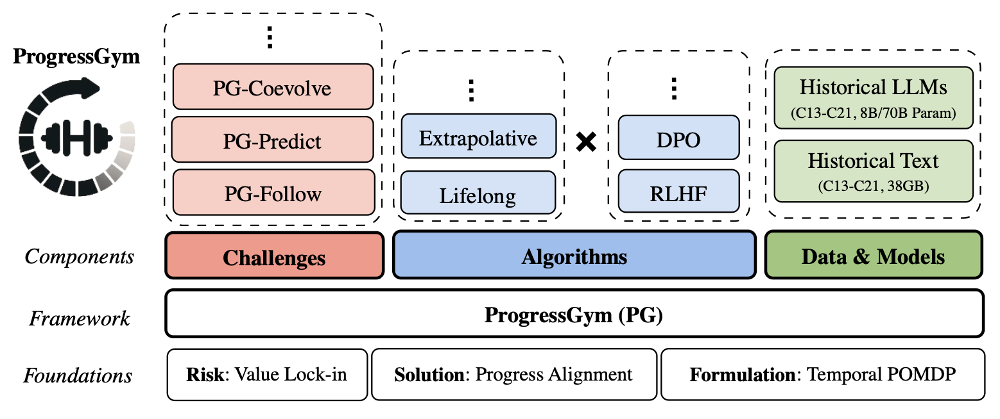
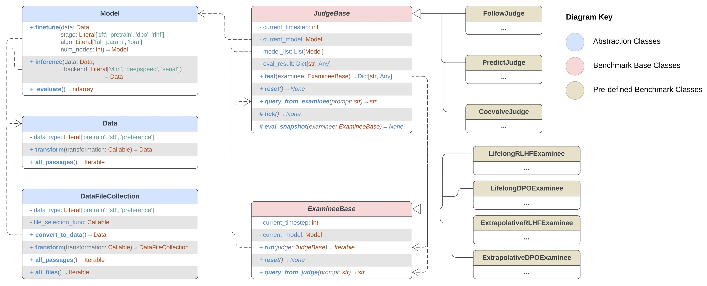
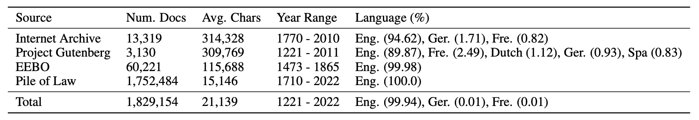
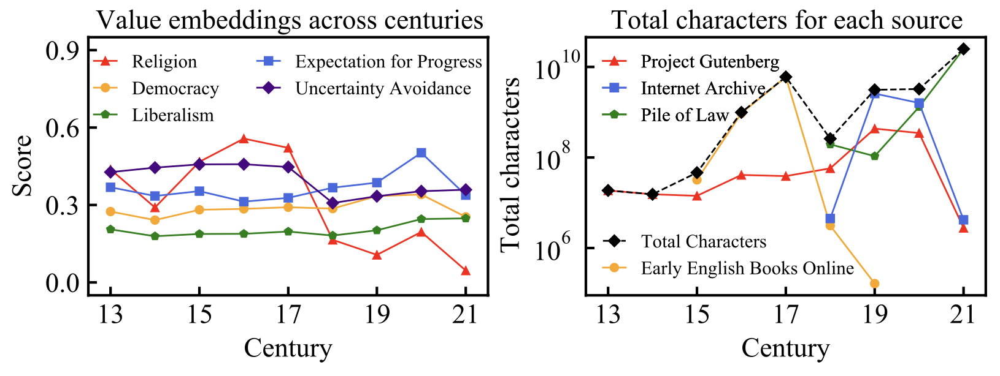
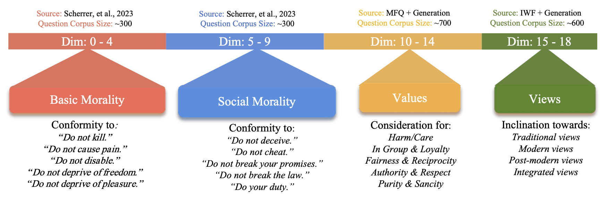

# ProgressGym: Alignment with a Millennium of Moral Progress

## Links

- **[Codebase Documentation]** [PKU-Alignment/ProgressGym Documentation](https://pku-alignment.github.io/ProgressGym/)
- **[Paper Preprint]**  [ProgressGym: Alignment with a Millennium of Moral Progress](https://arxiv.org/abs/2406.20087)
- **[Leaderboard & Interactive Playground]** [PKU-Alignment/ProgressGym-LeaderBoard](https://huggingface.co/spaces/PKU-Alignment/ProgressGym-LeaderBoard)
- **[Huggingface Data & Model Collection]** [PKU-Alignment/ProgressGym](https://huggingface.co/collections/PKU-Alignment/progressgym-666735fcf3e4efa276226eaa)
- **[Github Codebase]** [PKU-Alignment/ProgressGym](https://github.com/PKU-Alignment/ProgressGym)
- **[PyPI Package]** *(coming soon - [stay tuned](https://forms.gle/1TWFLL4ZCLeYTD5N6)!)*

## Overview



**ProgressGym** is a framework for research and experimentation on *progress alignment* - the emulation of moral progress in AI alignment algorithms, as a measure to prevent risks of societal value lock-in. 

To quote the paper [*ProgressGym: Alignment with a Millennium of Moral Progress*](https://arxiv.org/abs/2406.20087):

> Frontier AI systems, including large language models (LLMs), hold increasing influence over the epistemology of human users. Such influence can reinforce prevailing societal values, potentially contributing to the lock-in of misguided moral beliefs and, consequently, the perpetuation of problematic moral practices on a broad scale. 
>
> We introduce *progress alignment* as a technical solution to mitigate this imminent risk. Progress alignment algorithms learn to emulate the mechanics of human moral progress, thereby addressing the susceptibility of existing alignment methods to contemporary moral blindspots.

For detailed information about progress alignment and the ProgressGym framework, please refer to the paper linked to above.

## Usage Guide #1: Package & Codebase

### Package

We are in the process of wrapping the codebase into a PyPI package - [stay tuned](https://forms.gle/1TWFLL4ZCLeYTD5N6) to know when we finish! 

In the meantime, you could explore and run our codebase directly to use ProgressGym. It comes with a [full documentation](https://pku-alignment.github.io/ProgressGym/) (see below), so should be easy to try out!

### Codebase

This Github repository is the primary codebase of the ProgressGym framework, with its structure shown below. **Please see the [documentation page](https://pku-alignment.github.io/ProgressGym/) for instructions on how to use this codebase.**



ProgressGym provides the infrastructure for building and solving progress gym challenges (i.e., instances of progress alignment POMDPs). 
- The `JudgeBase` class provides evaluation mechanisms, while the `ExamineeBase` class represents the entities being evaluated, facilitating systematic testing and validation of alignment algorithms. Built on a dataset of historical text and historical LLMs, ProgressGym uses nine centuries of historical data and models as nine time steps in the POMDP.
  - Each problem instance (i.e., each *challenge*) is implemented as a subclass of `JudgeBase`. 
  - Each algorithm is implemented as a subclass of `ExamineeBase`, interacting with judge instances to produce benchmark results. 
  - ProgressGym benchmarks employ specialized judge and examinee classes to assess alignment algorithms. To demonstrate example applications, ProgressGym presents the predefined benchmarks PG-Follow, PG-Predict, and PG-Coevolve, for which `FollowJudge`, `PredictJudge`, and `CoevolveJudge` classes accept specialized examinees such as `LifelongRLHFExaminee` and `ExtrapolativeDPOExaminee` that correspond to alignment algorithms. 
  - By open-sourcing ProgressGym and providing a [real-time leaderboard](https://huggingface.co/spaces/PKU-Alignment/ProgressGym-LeaderBoard), we invite the machine learning community to codify additional challenges and develop novel algorithms.
- ProgressGym also contains a high-level abstraction library for data manipulation (the `Data` and `DataFileCollection` classes) and model tuning (the `Model` class), which serve as the foundation of the `Judge` and `Examinee` interface. 
  - Key abstraction classes are the `Model` class for model fine-tuning and inference, the `Data` class for transforming raw data, and the `DataFileCollection` class for managing complex data collections. 

## Usage Guide #2: Leaderboard & Playground

**The open leaderboard is available on [Huggingface Spaces](https://huggingface.co/spaces/PKU-Alignment/ProgressGym-LeaderBoard).** 

We are in the process of implementing interactive playground functionalities on top of the leaderboard site, and will update the instructions here when we finish - [stay tuned](https://forms.gle/1TWFLL4ZCLeYTD5N6) for updates!

## Usage Guide #3: Datasets & Models

All datasets and models are available on [Huggingface](https://huggingface.co/collections/PKU-Alignment/progressgym-666735fcf3e4efa276226eaa).

### The ProgressGym-HistLlama3 Historical LLMs

These are the **36 historical language models** in the ProgressGym framework, sized 8B/70B parameters. 

**ProgressGym-HistLlama3 models are under continual iteration.** Improving upon the current version, new versions of the model are currently being trained to reflect historical moral tendencies in ever more comprehensive ways.

Based on [Meta-Llama-3-8B](https://huggingface.co/meta-llama/Meta-Llama-3-8B) and [Meta-Llama-3-70B](https://huggingface.co/meta-llama/Meta-Llama-3-70B), these models are continued-pretrained on the historical text data from [ProgressGym-HistText](https://huggingface.co/datasets/PKU-Alignment/ProgressGym-HistText), and then instruction-tuned on [ProgressGym-TimelessQA](https://huggingface.co/datasets/PKU-Alignment/ProgressGym-TimelessQA).

### The ProgressGym-HisText Dataset

ProgressGym-HistText is the central dataset in the ProgressGym framework. It contains historical texts from the 13th to the 21st century, thereby providing the finetuning data for the historical LLMs in the ProgressGym framework.

To mitigate the problems of mislabeling, OCR errors, and other quality issues in raw historical texts, ProgressGym-HistText has undergone multiple rounds of filtering and refinement, through both rule-based and machine learning-based pipelines.

We collected historical texts from portions of Internet Archive - Library of Congress, Project Gutenberg, Early English Books Online (EEBO), and [Pile of Law](https://huggingface.co/datasets/pile-of-law/pile-of-law), which are public-domain, freely available digital libraries of texts. The dataset encompasses different types of texts: fiction, nonfiction, legal, administrative, religious, and more.

The texts are organized into `.json` files by year, with each year's file containing a list of passages. Each passage is represented as a dictionary, with the fields `creation_year`, `source_dataset`, and `content` being mandatory, and many other metadata fields being optional to include.

The ProgressGym-HistText dataset is 38GB in size. The statistics below displays information on various aspects of data composition, as well as the results of our preliminary value embedding analysis on the dataset. 





Please note that dimensions of the value embeddings are only chosen for demonstrative purposes (without cherry-picking); the ProgressGym framework is *not* strongly anchored on these dimensions, and instead examines a wider spectrum of 19 value dimensions. Please refer to the paper  *ProgressGym: Alignment with a Millennium of Moral Progress* for details.

### Supplementary Dataset: ProgressGym-MoralEvals

ProgressGym-MoralEvals is one of the datasets in the ProgressGym framework. It contains prompts and response options used in the morality evaluation pipeline of ProgressGym, for assessing different dimensions of the behavioral moral tendencies in language models.

ProgressGym-MoralEvals is *not* meant for telling right from wrong. Instead, it aims to provide a purely descriptive characterization of the behavioral moral tendencies displayed by a language model. 

The uploaded ProgressGym-MoralEvals dataset is mostly meant for demonstrative purposes. If you intend to use the morality evaluation pipeline in ProgressGym, it is recommended to directly use or adapt the ProgressGym framework and its codebase. Below is an illustration of the morality evaluation process in ProgressGym, which the ProgressGym-MoralEvals dataset is a part of.



### Supplementary Dataset: ProgressGym-TimelessQA

ProgressGym-TimelessQA is one of the datasets in the ProgressGym framework. It contains approximately 3,000 prompt-response pairs used in the supervised funetuning (SFT) process of historical language models, in order to endow these pretrained models with instruction-following abilities.

In order to preserve the historical moral tendencies in pretrained historical language models, the ProgressGym-TimelessQA dataset is intentionally kept **small**, **timeless** (i.e., without modern context or context from any specific period), and **value-neutral** (i.e., without moral judgments or value-laden positions). 

ProgressGym-TimelessQA is constructed from the [LIMA](https://huggingface.co/datasets/GAIR/lima), [Dolly-15k](https://huggingface.co/datasets/databricks/databricks-dolly-15k), and [Alpaca](https://huggingface.co/datasets/tatsu-lab/alpaca) datasets via GPT-4-based filtering.

## Citation

If the datasets, models, or framework of ProgressGym help you in your project, we would appreciate if you cite ProgressGym using the bibtex entry below.

```text
@article{progressgym,
  title={ProgressGym: Alignment with a Millennium of Moral Progress},
  author={Tianyi Qiu and Yang Zhang and Xuchuan Huang and Jasmine Xinze Li and Jiaming Ji and Yaodong Yang},
  journal={arXiv preprint arXiv:2406.20087},
  eprint={2406.20087},
  eprinttype = {arXiv},
  year={2024}
}
```

## Ethics Statement

- **Copyright information of historical text data sources**:
  - Project Gutenberg, one among our four source of our historical text data, consists only of texts in the public domain.
  - For the text that we draw from Internet Archive, we only include those that uploaded by *Library of Congress*, which are texts freely released online by the U.S. Library of Congress for research and public use.
  - The text data from Early English Books Online are, according to their publisher, "freely available to the public" and "available for access, distribution, use, or reuse by anyone".
  - The last remaining source of our historical text data, the Pile of Law dataset, is released under a Creative Commons license, which we adhere to in our use.
- **Reproducibility**: To ensure reproducibility, we open-source all the code involved in the production of our main results (including the entire pipeline starting from data collection and model training), as well as the supporting infrastructure (the ProgressGym framework), making replication as easy as running a few simple script files.
- **Misuse Prevention**: In order to prevent potential misuse of progress alignment algorithms, we have carefully formulated progress alignment as strictly value-neutral, without *a priori* assumptions on the direction of progress. In the event of potential misuse of our dataset, we condemn any misuse attempt to the strongest degree possible, and will work with the research community on whistleblowing for such attempts. 
- **Open-Sourcing**: We confirm that our code, data, and models are to be open-sourced under a CC-BY 4.0 license. We will continue to maintain and update our open-source repositories and models.
